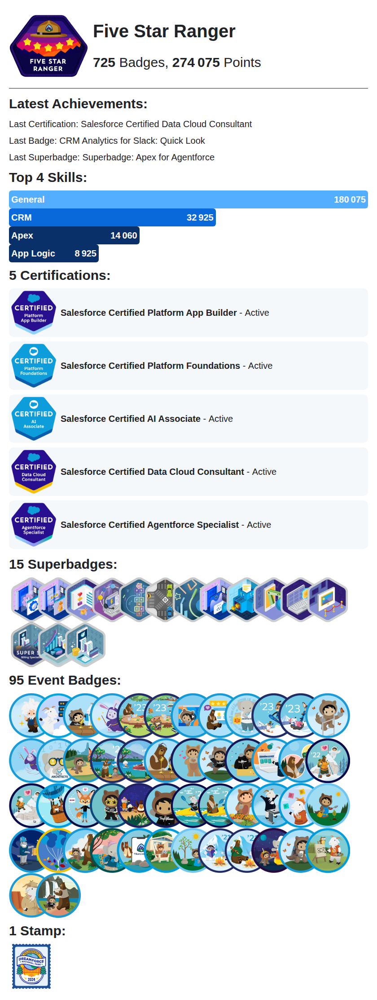

<h1>Hello, people of the internet </h1>

<h2>🐱‍💻 About me</h2>
<ul>
    <li> I'm Nathan !</li>
    <li> Salesforce Architect</li>
    <li> Cofounder of <a href="https://think2.ai">Think2</a></li>
    <li> <a href="https://www.esilv.fr/">ESILV</a> & <a href="https://www.hanze.nl/eng">Hanze</a></li>
    <li> I have a cat called Newton</li>
    <li> Five Star Ranger</li>
</ul>

<h2>
 My speaks</h2>
<ul>
    <li> At French Touch Dreamin' 22: <a href="https://speakerdeck.com/nabondance/frenchtouchdreamin-real-data-in-dev-environment-from-myth-to-reality">Real data in dev environment</a>   <a href="https://www.youtube.com/watch?v=skFz7WMMnsE&ab_channel=FrenchTouchDreamin">video</a></li>
    <li> At French Touch Dreamin' 23: <a href="https://speakerdeck.com/nabondance/frenchtouchdreamin-elevate-your-devops-how-scratch-orgs-pools-fit-into-your-salesforce-strategy">How Scratch Orgs Pools Fit Into Your Salesforce Strategy</a>   <a href="https://www.youtube.com/watch?v=09WEqN1emIM&ab_channel=FrenchTouchDreamin">video</a></li>
    <li> At Agentforce World Tour Paris 25: <a href="https://github.com/Think2Corp/AgentforceWorldTour25">Agentforce CLI: Créer un agent depuis votre terminal</a></li>
    <li> At Viva Tech 25: <a href="https://speakerdeck.com/nabondance/vivatech2025-salesforce-dans-notre-quotidien">Salesforce dans notre quotidien</a></li>
</ul>

<h2>
  Current open source projects</h2>
<ul>
  <li><a href="https://thb.nabondance.me">Trailhead-Banner</a>: a website to generate your LinkedIn banner based on your Trailhead stats</li>
  <li><a href="https://github.com/nabondance/Trailhead-Stats">Trailhead-Stats</a>: a GH Action to bring Trailhead into GitHub profile Readme (see below)</li>
</ul>

<h2>
  My Trailhead Stats</h2>
<!--TH_Stats:start-->

<a href="https://www.salesforce.com/trailblazer/nabondance">
<picture>
    <source media="(prefers-color-scheme: light)" srcset="TS-cards/TScard-light.png">
    <source media="(prefers-color-scheme: dark)" srcset="TS-cards/TScard-dark.png">
    
</picture>
</a>
<!--TH_Stats:end-->

  
<h2> Technologies & Tools</h2>

  <h3>
   OS & IDE</h3>

 

 

  <h3>
   Tools</h3>

 

  <h3>
   Languages</h3>

 

 

  <h3>
  Clouds</h3>

 

  <h3>
    Framework</h3>

  <h3>
    Databases</h3>

  
<h2>
   Github Stats</h2>

  <h3>
   Streak Stats</h3>
  <!-- GitHub Readme Streak Stats - https://github.com/nabondance/github-readme-streak-stats -->
   
    
  

  <!-- <h3>🏆 GitHub Trophies</h3> -->
  <!-- https://github.com/ryo-ma/github-profile-trophy -->
  <!--  -->

  <!-- https://github.com/ashutosh00710/github-readme-activity-graph -->
  

  <h3>
   Metrics</h3>
  <!-- https://github.com/lowlighter/metrics -->
  

<!-- https://github.com/Platane/snk -->
<picture>
  <source media="(prefers-color-scheme: dark)" srcset="https://raw.githubusercontent.com/nabondance/nabondance/output/github-snake-dark.svg">
  <source media="(prefers-color-scheme: light)" srcset="https://raw.githubusercontent.com/nabondance/nabondance/output/github-snake.svg">
  
</picture>